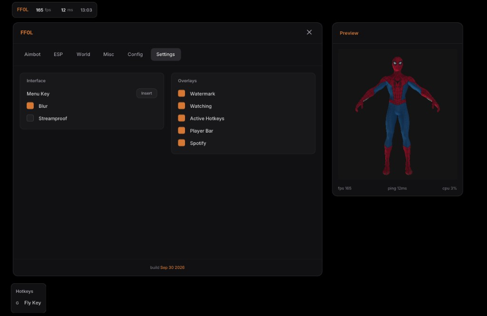

# imgui-2



A custom ImGui menu and a 3D model preview. The widgets are drawn by hand, so the menu does not use the default Dear ImGui style.

## Build

Open `app.sln` in Visual Studio 2026 (toolset v145). Build **Release | x64**.

The executable is `bin/x64/Release/FF0L.exe`.

Insert opens and closes the menu. End, or the X in the header, quits.

## Menu

The window is two columns.

| Page | What is on it |
| --- | --- |
| Aimbot | Aim, silent aim, FOV, and trigger (delay in milliseconds, a key, or always on) |
| ESP | Player and box options, plus the preview |
| World | Lighting, atmosphere, particles, fog, camera |
| Misc | Movement and effects |
| Config | Save, load, and delete configs next to the executable (`configs/*.cfg`) |
| Settings | Menu key, blur, streamproof |

Sliders for a feature show up only while that feature is enabled.

The preview is its own window. Dragging the main menu moves it with the menu. Dragging the preview alone leaves it where you put it.

## 3D preview

`src/ui/preview.cxx` loads an FBX with [ufbx](https://github.com/ufbx/ufbx), samples the body and mask diffuse textures, and draws the mesh into the preview.

Drag inside the preview to orbit. The model is framed to fill the view. The path to the FBX and the textures is set in `Model3DRenderer::init`.

## Layout

```
src/main.cxx          window, device, frame loop
src/ui/shell.cxx      menu pages
src/ui/menu.cxx       menu window, preview window, side lists
src/ui/widgets.cxx    controls
src/ui/preview.cxx    3D renderer
src/ui/theme.hxx      colors
src/ui/layout.hxx     spacing and sizes
vendor/               Dear ImGui, FreeType, ufbx
```

Dear ImGui, FreeType, and ufbx keep their own license notices.
